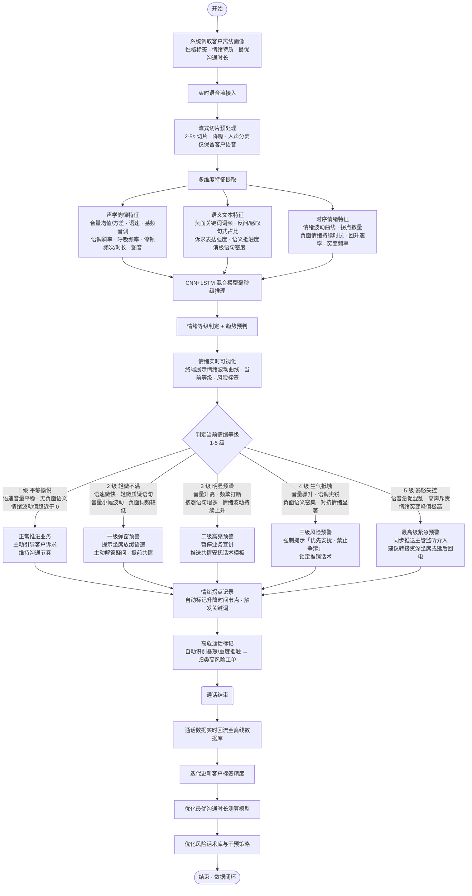

# 实时通话情绪识别与干预 — 工作流程图

```mermaid
graph TD
    A([开始]) --> A1[系统调取客户离线画像<br>性格标签 · 情绪特质 · 最优沟通时长]
    A1 --> B[实时语音流接入]

    B --> C1[流式切片预处理<br>2-5s 切片 · 降噪 · 人声分离<br>仅保留客户语音]
    C1 --> C2[多维度特征提取]
    C2 --> C2a[声学韵律特征<br>音量均值/方差 · 语速 · 基频音调<br>语调斜率 · 呼吸频率 · 停顿频次/时长 · 颤音]
    C2 --> C2b[语义文本特征<br>负面关键词词频 · 反问/感叹句式占比<br>诉求表达强度 · 语义抵触度 · 消极语句密度]
    C2 --> C2c[时序情绪特征<br>情绪波动曲线 · 拐点数量<br>负面情绪持续时长 · 回升速率 · 突变频率]
    C2a --> D
    C2b --> D
    C2c --> D

    D[CNN+LSTM 混合模型毫秒级推理] --> E[情绪等级判定 + 趋势预判]
    E --> V[情绪实时可视化<br>终端展示情绪波动曲线 · 当前等级 · 风险标签]
    V --> F{判定当前情绪等级<br>1-5 级}

    F -->|1 级 平静愉悦<br>语速音量平稳 · 无负面语义<br>情绪波动值趋近于 0| G1[正常推进业务<br>主动引导客户诉求<br>维持沟通节奏]

    F -->|2 级 轻微不满<br>语速微快 · 轻微质疑语句<br>音量小幅波动 · 负面词频较低| G2[一级弹窗预警<br>提示坐席放缓语速<br>主动解答疑问 · 提前共情]

    F -->|3 级 明显烦躁<br>音量升高 · 频繁打断<br>抱怨语句增多 · 情绪波动持续上升| G3[二级高亮预警<br>暂停业务宣讲<br>推送共情安抚话术模板]

    F -->|4 级 生气抵触<br>音量骤升 · 语调尖锐<br>负面语义密集 · 对抗情绪显著| G4[三级风险预警<br>强制提示「优先安抚 · 禁止争辩」<br>锁定推销话术]

    F -->|5 级 暴怒失控<br>语音急促混乱 · 高声斥责<br>情绪突变峰值极高| G5[最高级紧急预警<br>同步推送主管监听介入<br>建议转接资深坐席或延后回电]

    G1 --> H[情绪拐点记录<br>自动标记升降时间节点 · 触发关键词]
    G2 --> H
    G3 --> H
    G4 --> H
    G5 --> H

    H --> I[高危通话标记<br>自动识别暴怒/重度抵触 → 归类高风险工单]

    I --> J(通话结束)

    J --> K[通话数据实时回流至离线数据库]
    K --> L1[迭代更新客户标签精度]
    L1 --> L2[优化最优沟通时长测算模型]
    L2 --> L3[优化风险话术库与干预策略]
    L3 --> M([结束 · 数据闭环])
```
